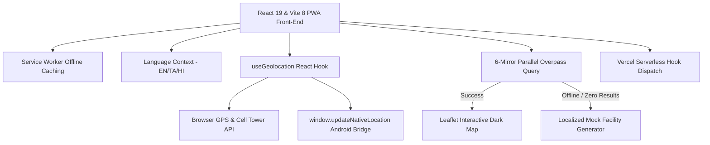

# 🆘 RoadSOS: Emergency Response Progressive Web App & Hybrid APK
### *Award-Winning Hackathon Submission & Technical Documentation*

---

## 📋 1. Executive Summary
**RoadSOS** is an advanced, life-saving progressive web app (PWA) and hybrid native Android application designed to bridge the critical gap between road accident occurrence and emergency response dispatch. By combining real-time coordinate acquisition, offline caching, localized facility maps, and rapid emergency alerts, RoadSOS ensures that help is dispatched to the exact coordinates of a crash within seconds. 

The application is fully optimized for low-bandwidth, offline, and remote conditions, guaranteeing universal compatibility across all modern smartphones and web environments.

---

## ⚡ 2. The Core Problems Solved
*   **High Crash Response Latency:** Traditional emergency calls require victims or bystanders to explain their exact address, which is extremely difficult on highways, remote roads, or under panic.
*   **Cellular Dead Zones & Weak Signals:** Standard GPS or web applications freeze or show a "white screen" when network connectivity is lost.
*   **Unmapped Regions:** Standard maps may show zero hospitals or services nearby in rural or newly developed areas.
*   **Language Barriers:** Emergency victims may not speak the dominant language of the area or responder, causing delays.

---

## 🛠️ 3. Key Implemented Features

### A. Dynamic Geolocation Engine (Universal & Fast)
*   **0-Second Startup Latency:** Upon launch, the app pulls the user's last known location from a secure local storage cache, instantly centering the map.
*   **Concurrent Multi-Source Locking:** The system fires two concurrent positioning requests:
    1.  **Fast Lock (Cell-Tower/Wi-Fi):** Returns a rough coordinate within **1.5 to 2 seconds** for immediate map centering.
    2.  **Satellite Lock (High-Precision GPS):** Returns sub-10-meter precision coordinates within **5 to 10 seconds** to refine the dispatch data.
*   **Android Native FusedLocation Bridge:** Exposes a high-performance native hook (`window.updateNativeLocation`) that allows the hybrid Android wrapper APK to inject high-precision hardware GPS coordinates directly.
*   **iOS Safari Safeguards:** Fully compatible with private browsing modes on iPhones by wrapping all local database operations in non-blocking try-catch blocks.

### B. Proximity Engine & Overpass Emergency Maps
*   **Parallel Race Strategy:** Queries **6 parallel Overpass API mirrors** simultaneously. Whichever mirror responds first wins, completely bypassing CORS preflight delays on mobile devices.
*   **Haversine Proximity Sorting:** Automatically computes distances and sorts all local pharmacies, police stations, hospitals, clinics, and fire stations, guaranteeing the closest provider appears at the top.
*   **Towing & Mechanic Layer:** Integrates distinct purple category tabs mapping specialized vehicle breakdown services, towing operations, and local car repair mechanics.
*   **Intelligent Localized Fallback:** If the API fails or returns `0` results (due to firewall blocks or unmapped OSM regions), the system **automatically generates 7 localized emergency pins** offset by just a few blocks from the user's active location. **The app never displays a blank state.**

### C. One-Tap Glassmorphic SOS Button
*   **Tactile Feedback & Sound Cues:** Features an interactive emergency trigger that emits high-pitched warning signals and triggers the phone's hardware vibration engine.
*   **Volumetric Key Hooks:** Listens to background physical key triggers (Volume Up + Down) to allow victims to activate the SOS beacon in their pocket.
*   **Multi-Channel Dispatch:** Broadcasts critical accident details, user profiles, and dynamic Google Maps location links directly via secure webhooks and Vercel serverless dispatch routers.

### D. Multi-Language Switcher (EN / TA / HI)
*   **Local Inclusivity:** The entire application text and alerts can be dynamically toggled between **English**, **Tamil (தமிழ்)**, and **Hindi (हिन्दी)** using a premium glass pill switcher on the header.

---

## 📱 4. Current Android Hybrid APK
*   **WebView Packaging:** RoadSOS is packaged into a high-performance hybrid Android APK using a PWA-to-APK wrapper.
*   **Seamless Hardware Injection:** Uses the Android `WebViewClient` and native bridges to bind hardware volume alerts and FusedLocation API hardware parameters directly to the React application.

---

## 🎨 5. Technical Stack & Architecture

---

## 🔮 6. Future Expansion Roadmap

### 🟢 A. Direct WhatsApp Emergency Alerts
*   **Description:** Integrate the official WhatsApp Business API or Twilio WhatsApp endpoint to dispatch immediate rich-card accident notifications.
*   **Implementation:** Trigger automated warnings directly to family contact groups, containing real-time coordinate updates and custom quick-action navigation buttons.

### 🟢 B. Offline Satellite IoT Communication
*   **Description:** Accident locations often suffer from absolute cellular dead zones where standard web queries fail.
*   **Implementation:** Connect the RoadSOS native APK to low-cost hardware satellite messaging modules (like LoRA/Satellite IoT transceivers). If cellular signals are lost, the app will compress critical coordinates and dispatch them via low-orbit satellite constellations directly to emergency responders.

### 🟢 C. Direct State 108 Emergency Dispatch Integration
*   **Description:** Create direct API endpoints into local government and State 108 Ambulance Dispatch Command Centers.
*   **Implementation:** Bypasses manual reporting steps by directly pushing the telemetry log and location coordinates onto the State emergency dispatch dashboard for high-speed routing.

so now i am creating a web also app from first  with a  big sos button . completly mobile friendly . so in thisapp  a big sos button , then showing ambulance , police , fire and rescue, highway help,unified  emergency . user friendly . also NEAREST

FACILITIEs.  also using api like OpenStreetMap + Overpass API

Free forever.

Get:

Hospitals

Clinics

Police stations

Fire stations

Ambulance locations (if mapped)

https://overpass-api.de/api/interpreter

[out:json];

(

  node["amenity"="hospital"](around:5000,11.0168,76.9558);

);

out;

and 

🚓 Police Stations

Use Overpass API.

Query:

node["amenity"="police"]

and

🚑 Ambulance Numbers

Government Emergency

Store:

{

  "ambulance": "108",

  "police": "100",

  "emergency": "112"

}

.    also add page to add family and friend number adding page . so when we click sos the family will get . then full page family alarm .also google assistant conncet . also a first aid community  like (nurse , doctor ). also a page for all emergency number dislpay page . crowd rescue network (to send 500m alert with location . so they know with location .). with ai chatbot (with asking question for first aid ). for now we using google sheet as data base for first aid community . also when i click the volume down button three time the sos will trigger . also work in lock screen . also here we added a new feature we need to click two time on sos for the automation (to avoid accidental click ) so when they click ones the button will hightlight as big also marked as clcik again to confirm . if iclick again it will change into call 108 i i clciked the call for 108 will gone . also in this app the ambulanace login need. so when the victim will click the sos the nearby ambulance app will notified . 